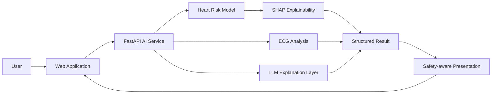

# Nabdak — Heart Disease AI Platform

> Graduation project (A+) combining machine-learning risk prediction, ECG analysis, explainable AI, LLM-assisted explanations, and a FastAPI AI service.

[Live Demo](https://heart-disease-prediction-kohl.vercel.app/heart) · [Project Documentation](https://github.com/omarbazooka/Documentations-of-Graduation-Project)

## Project overview

Nabdak was built as a team graduation project at the Egyptian E-Learning University. The platform explores how multiple AI components can work together in a healthcare-oriented application while keeping the user experience understandable and safety-aware.

**My role:** project lead / AI-track owner in an 8-member team, responsible for the machine-learning workflow, AI service integration, ECG-related AI flow, explainability, and LLM-powered patient-facing outputs.

## AI capabilities

- Heart-disease risk classification from **11 clinical features**.
- Approximately **95% classification accuracy** on the evaluated set of **238 patient profiles**.
- ECG-analysis workflow for surfacing relevant findings.
- **SHAP**-based explainability for model predictions.
- LLM-generated, patient-friendly explanations around model outputs.
- Safety-aware recommendations and downloadable reporting workflows.
- AI functionality exposed through a dedicated **FastAPI** service.

## High-level architecture

## Engineering focus

### Multi-model AI integration

The project is more than a single classifier. It combines structured-data ML, ECG-related analysis, explainability, and LLM workflows behind one application-facing API layer.

### Explainability

SHAP is used to expose feature-level influence so a prediction can be presented with supporting context rather than as an unexplained probability.

### API separation

AI components are served through FastAPI, keeping model logic separate from the frontend and making the system easier to test, maintain, and evolve.

## Tech stack

`Python` · `FastAPI` · `Machine Learning` · `ECG` · `SHAP` · `LangChain` · `Groq API` · `LLMs`

## Project evidence

- **Academic result:** A+ graduation project.
- **Model result:** ~95% accuracy on the evaluated 238-profile dataset.
- **Repository:** includes the application code, project documentation, Postman assets, and presentation material.

## Important medical disclaimer

This project is an **academic and research system**. It is not a clinically validated diagnostic device and does not replace professional medical advice, diagnosis, or treatment. The repository license also restricts commercial medical decision-making without proper clinical validation and approval.

## Team project

Nabdak was developed collaboratively as a university graduation project. This README highlights the AI track and the work I directly led or implemented; the full repository and project documentation represent the wider team's work.
